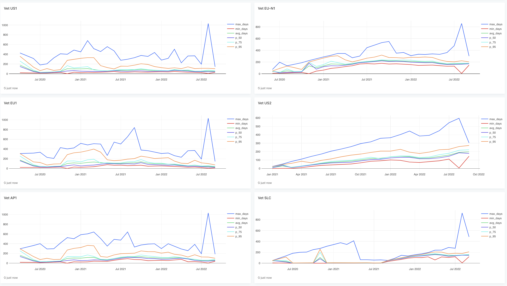

# Audit Scaling

## Goal:
When a node joins the network, it goes through a vetting process. One aspect of the node vetting process is auditing
the nodes for pieces they should be storing. A node must successfully complete a certain number of audits to pass the
vetting process. As more nodes join the network, the vetting process for each node takes longer because the satellite is
limited by how many total audits it can perform. As we onboard new nodes, the vetting process
takes increasingly longer for individual nodes. We need to be able to scale auditing depending on how many new nodes
recently joined. At the moment, each satellite has a default of 2 concurrent audit workers.

However, the more data is uploaded, new nodes are more likely to get data, therefore more audits.
A node is considered vetted when it receives a total of 100 audits. Unvetted/new nodes get 5% of data
from new uploads. This means, less than 5% of all audits are going to these new nodes. We don't want to increase
the percentage of uploads that go to new nodes, nor do we want to decrease the number of audits it takes
to vet a node because we don't want to risk lowering the overall quality of nodes on the network, effecting network durability.

See this [dashboard](https://redash.datasci.storj.io/dashboard/vetting?p_FILTER=created_at&p_PERIOD=year) to compare vetting times.
Here is a screenshot in case you can't access the dashboard. It shows percentiles for how long nodes took to get vetted, grouped by the month they were vetted.


In terms of how we're going to scale the number of audit workers (both ones for regular audits and reverify audits),
we plan to manually adjust them based on metrics. It currently takes on average between 2-3 months to get vetted.
We may want to lower this to 1 month.

## Problem:
We can't safely scale the number of audit workers with the current implementation of the containment system. The core
issue is that there can only be one piece pending audit for a node at a time.
The function [IncrementPending](https://github.com/storj/storj/blob/270204f352af0a7e3cb16c19dc988aa6a90563e0/satellite/satellitedb/containment.go#L66)
will effectively dismiss any future pending audits for a node if they are not the same as the one already in question.
```
if !bytes.Equal(existingAudit.ExpectedShareHash, pendingAudit.ExpectedShareHash) {
		containment.db.log.Info("pending audit already exists",
		    zap.String("node id", pendingAudit.NodeID.String()),
		    zap.String("segment streamid", pendingAudit.StreamID.String()),
			zap.Uint64("segment position", pendingAudit.Position.Encode()),
			)
		return nil
}
```

A pending audit is an audit for a piece that needs to be re-verified because the connection expired before the online node responded to the request.
If a node has a pending audit, it is said to be contained. We will re-verify, or check for the piece again, a certain
number of times before disqualifying the node. If it passes the recertification before the max retry limit, then it is
removed from containment mode.

When there are multiple audit workers, if more than one audits a node within the same timeframe, a node can cheat the system by creating a pending audit only for the piece it does
have while concealing the fact that it is missing other data. The likelihood of tricking the system increases with the
number of workers concurrently auditing a node. Currently, we have two audit workers, with a small chance of auditing the
same node within the same time period (the timeout window is set for 5 minutes). However, as we increase the number of
workers, the likelihood also increases.

Here is an example. We will use two workers for simplicity. Let's say these two workers, A1 and A2, are auditing pieces
P1 and P2 on node N, respectively. A1 and A2 audit N within the same 5 minute window. N has a correct version of P2 but not P1,
so it closes the connection to A2 first (this would have to be a modified node program).
A2 then puts P2 into pending audits and contains N. Once the connection
to A1 is closed, A1 will attempt to place P1 in pending audits (in method IncrementPending) but since there is already a
pending audit for N, it doesn't track P1 in pending audits. P2 will be reverified the next round and N can return the
correct data and remove itself from containment mode. It can continue this process and indefinitely avoid disqualification,
as long as the multiple workers audit it concurrently.


Additionally, the node has a 'contained' flag that is set when it has pending audits, and unset when its audit score is
modified. We don't use this flag for anything other than a status on the node dashboard, but this is still an
inconsistency that will need to be addressed.


## Solution:
All audits should be allowed to add a piece to pending audits, and a successful audit removes only the corresponding entry.
The contained flag will remain set to true as long as there are pending audits for the node.

A solution that we think will decouple the logic around regular audits and reverification audits is the following:
- Rather than reverify nodes with pending audits and skipping them in the regular audit (see satellite/audit/worker.go:work),
  there will be a separate process that iterates over the data from the pending audits table and spins up workers to audit for those particular pieces.
- A regular audit can insert an entry into the pending audits table.
- A pending audit worker will select an entry to process from the pending audits table.
  - The result can be any of the audit outcomes or reverify count will be incremented if it times out again.
    - The next entry can be selected by oldest available (check last attempted time)
    - If a pending audit was attempted and reverification count is increased, don't try it again for x amount of time. Add field for attempted_at timestamp
      eg `WHERE attempted_at IS NULL OR attempted_at < now() - interval '6 hour'` in repairqueue.go:Select to find items to repair.
- Contained nodes will no longer be selected for new uploads

### Implementation details:
**Part 1. Implement new pending audit system**
- Create a new db table called reverification_audits based on segment_pending_audits
  - switch primary key from nodeid to combination of (node_id, stream_id, position)
  - we don't need stripe_index since we want to download the whole piece (client.Download with offset 0) 
  - add last_attempt: timestamp (nullable)
  - similar delete and read queries but using new primary key
  - migration plan: keep segment_pending_audits and drop the latter once this project is completed
- create audit/reverifier.go methods
  - implement reverify method based on the original from audit.go/verifier. 
  - We can target the specific piece in question, rather than checking all pieces in the segment.
- create audit/reverifier.go chore
  - will use workers similar to those in audit/worker.go 
  - Example:
```go
type Reverifier struct {
    log      *zap.Logger
    verifier *Verifier // includes access to containment db
    reporter Reporter
    Loop     *sync2.Cycle
    limiter  *sync2.Limiter
}

func NewReverifier(){}
func (reverifier *Reverifier) Run(ctx context.Context) (err error){}
func (reverifier *Reverifier) Close() error{}
func (reverifier *Reverifier) process(ctx context.Context, pendingaudit *PendingAudit)) error {} // this will do the job of the current verifier.go:reverify method
```
- create method satellitedb/containment.go:Insert
  - similar to existing increment pending but remove query for existing rows, just insert new pending audit directly into db.
- create method satellitedb/containment.go:Increment
  - increment the reverify count on the pending audit.
- add new satellite/audit/containment interface methods
  - Get could follow the same query pattern as the repair queue satellitedb/repairqueue.go:select
```go
    type Containment interface {
	Get //old
	IncrementPending //old
	Delete //old 
	Select(ctx context.Context) (*PendingAudit, error) //new version of Get
	Insert(ctx context.Context, pendingAudit *PendingAudit) error //new 
	Increment(ctx context.Context, pendingAudit *PendingAudit) error //new version of IncrementPending 
	Remove(ctx context.Context, <key>) (bool, error) //new version of Delete
```

**Part 2. Updates to existing audit system (decouple logic around regular vs re-verification audits)**
- remove call to reverify and related logic
  - in audit/worker.go:work() we attempt to reverify nodes for the segment that are in containment mode. 
  - Since we want verify and reverify to be in separate processes, we can remove all logic related to reverify here.
- update audit.go/verifier
  - remove reference to containment from verifier struct
  - delete existing reverify method
- remove satellitedb/containment.go methods that are no longer needed and switch any out that are still needed with the new versions
- satellite/core: audit setup, add Reverifier *audit.Reverifier

**Part 3. Keep node containment status updated**
- Update nodes table
  - add `field contained timestamp ( updatable, nullable )` (or bool)
  - Keep this status synced:
    - check for change in node contained status during reverifier chore
      - eg which nodes have pending audits before the chore vs after, then update the nodes table
    - Create a chore on the nodes table to verify the containment status
      - every so often, check if the nodes that are marked contained still have pending audits, and unmark them if they don't
      - this is to ensure we don't accidentally keep healthy nodes in a contained state
- satellitedb/overlaycache.go:selectAllStorageNodesUpload
  - Add `AND NOT contained` to node selection query to filter out contained nodes from getting more data
- satellitedb/repuations.go
  - populateUpdateNodeStats (line 508) remove logic around containment
  - updateNodeStats struct (line 641): remove contained field
- satellite/overlay/service.go (if needed)
  - NodeDossier: make sure to update the contained flag if the pending audits table contains any for the node.

**QA**
- Create a test plan
- Test that the original cheater strategy is no longer viable

**Deployment**
- Configure the number of audit workers for verifier and reverifier

**Post-deployment**
- monitor vetting times for new nodes and scale audit workers accordingly

### Future Work
Should we consider new nodes for audits at a different cadence from vetted nodes? This would require significant refactoring.
- This has been suggested by the community too. I don't think we can make it work without changing the entire architecture of the product, 
but what we _could_ do is use a different cadence for new _segments_ instead of new nodes. 
Old segments tend to be on old nodes (not always, but there is a correlation) so that would get us at least some of the same benefit.

Auto scaling workers: Scaling of those should depend on the number of unvetted nodes and the average time in vetting.
However, scaling for normal audits, should depend on the number of vetted nodes and amount of data on them.

For possible efficiency, a pending audit worker could query for one node ID and process all pending audits for that node at once.
This could cause artificial clustering that we might want to avoid, but is a tradeoff we could reconsider for performance.
Each worker would essentially have their own queue of pending audits to work from.
- If each item results in a successful response (not offline or timeout), continue. Else, skip until the next iteration of the chore?
  This may give the node too much leeway in terms of getting away missing data by timing out (artificial spreading).
- Query by unique node id and use that as the queue for querying all pending audits by node id (index on node id or first entry in a primary key)
