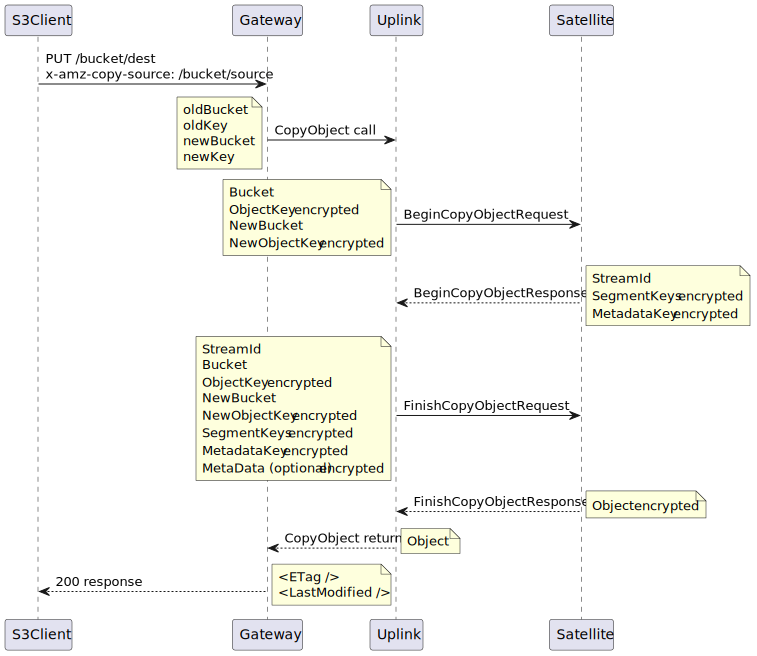
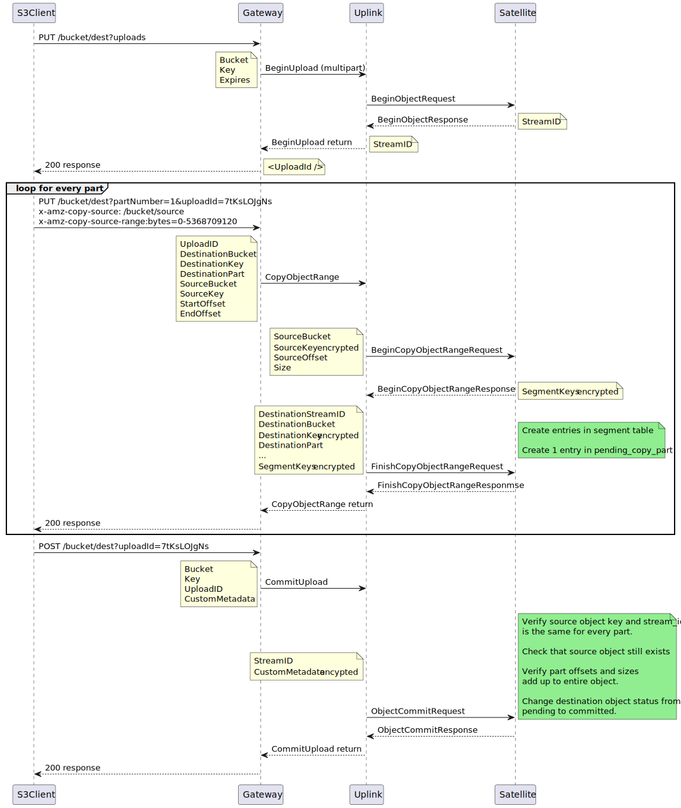
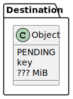
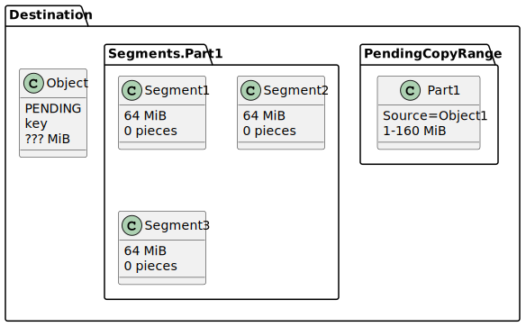
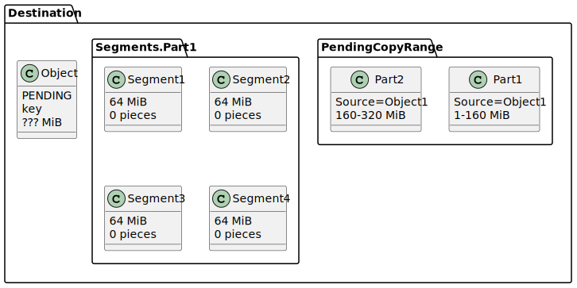
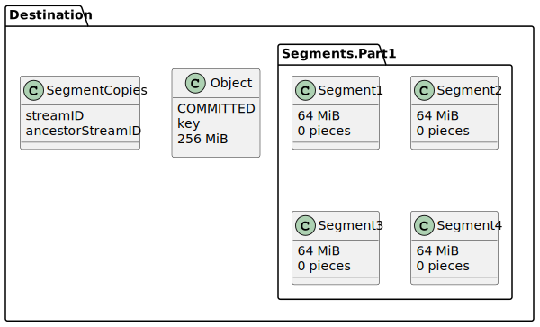
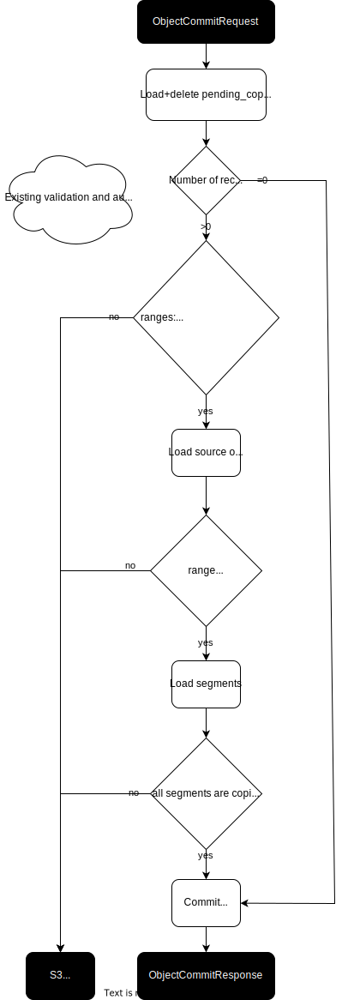

Byte Range Multipart Copy
===================

This document is a proposal on how to support S3's UploadPartCopy for Storj.

- [Blueprint Background](#Blueprint-Background)
- [Feature Background](#Feature-Background)
- [AWS-CLI Settings](#AWS-CLI-Settings)
- [High-Level Implementation Decision Motivation](#High-Level-Implementation-Decision-Motivation)
- [Restrictions compared to S3 API](#Restrictions-compared-to-S3-API)
- [API additions](#API-additions)
- [Database schema changes](#Database-schema-changes)
- [Metabase data shape](#Metabase-data-shape)
- [Validation](#Validation)
- [Affected existing endpoints](#Affected-existing-endpoints)
- [S3 parameter restrictions](#S3-parameter-restrictions)
- [Stop-gap implementation](#Stop-gap-implementation)
- [Performance impact](#Performance-impact)
- [Optimization of CommitObject](#Optimization-of-CommitObject)
- [Open questions](#Open-questions)
- [Alternative solutions](#Alternative-solutions)

Blueprint Background
------------

- Status: pending design approval, pending sales/product prioritization
- Author: Erik van Velzen
- Issue: https://github.com/storj/storj/issues/4875
- Requirements: https://github.com/storj/roadmap/issues/40
- Review: https://review.dev.storj.io/c/storj/storj/+/8156
- Meetings:
  - June 16th 2022: Jacob, Erik, Egon, Bill?, ???
  - June 27th 2022: Bill, Michal, Michael/Jacob?, Erik, Steve
- Major revision: 2

Feature Background
--------

UploadPartCopy is S3's method to copy larger objects. It extends multipart upload with the ability to copy byte ranges of existing objects. Amazon [limits CopyObject to 5GB](https://docs.aws.amazon.com/AmazonS3/latest/API/API_CopyObject.html#API_CopyObject_ResponseSyntax), after which you must use UploadPartCopy to copy an object with multiple calls.

Many S3 libraries such as boto3 for Python set a object size threshold, after which, uploads and copies will switch from CopyObject to UploadPartCopy. Given that the Storj S3 gateway does not currently support UploadPartCopy, exceeding this default threshold will return an error.

Customers expect their integrations to “just work” when Storj advertises S3 Compatibility. This feature gap frustrates customers as they’re onboarding and if not resolved, we will lose business.

AWS-CLI Settings
-------------

AWS CLI has the following options which affect UploadPartCopy:

- **multipart_threshold**: This value sets the size threshold for multipart uploads of individual files. The default value is 8 MB.
- **multipart_chunksize**: This value sets the size of each part that the AWS CLI uploads in a multipart upload for an individual file. This setting allows you to break down a larger file (for example, 300 MB) into smaller parts for quicker upload speeds. The default value is 8 MB.

We advise customers to increase these settings to reduce the number of roundtrips and the number of segments created per object. The number of segments is mostly relevant when doing the initial multipart upload.

High-Level Implementation Decision Motivation
----------

Like in the S3 protocol:
- the Storj implementation extends the existing multipart upload functionality
- the copy takes place server-side

The current system has constraints we have to account for with when copying data:

1. The Storj segment keys and metadata keys are encrypted with a content key which is deterministically derived on-demand by Uplink from the bucket, object key (= object identifier, not a cryptographic key) and customer encryption key. This means that for any change in object key the segment keys and metadata keys need to be re-encrypted by Uplink.
2. We have no functionality to create an object from ranges of data. Maybe it will be added when we add small file packing.
3. The current server-side copy schema implies a copy has a single original source object.
4. The current server-side copy schema implies a segment in the copy has the same location (part+index) as in the original object.

This design/implementation will stay within these constraints.

This leads to the following design choices:
1. We only allow full copies of objects. So an object may be copied in multiple steps, but in the end it must result in a complete copy. It is checked on object commit at the latest that this condition holds.
2. We will copy entire segments only. If a byte range does not fully eclipse a segment, the entire segment is copied anyways. This goes for both the start and the end of the range.
3. The requested byte ranges are administered separately.
4. If a segment is in multiple byte ranges to the same destination object, it is only copied once: the segment copies are deduplicated
5. The copy will get the same part structure as the source object, even if the parts are defined differently during the byte-ranged copy.

Note that the ranged copy request may arrive out-of-order, but the resulting copy must still be in-order. This is possible because every copy request has its own different destination part.

Restrictions compared to S3 API
------------

The implementation does not allow for the following scenario's:

1. Create an object from ranges of two or more different objects
2. Create an object from one or more ranges which do not entirely include the source object
3. Create an object from source ranges which overlap
4. Create an object from copied ranges combined with newly uploaded data

These scenario's will be explicitly checked, at the latest when the user commits the multipart upload. A human-readable non-recoverable error is returned. The multipart upload will be cancelled.

See also the section [S3 parameter restrictions](#S3-parameter-restrictions) below for additional caveats.

API additions
----------

We introduce this new method in package `storj.io/uplink/private/multipart`

```go
func CopyObjectRange(
    ctx context.Context,
    project *uplink.Project,
    sourceBucket string,
    sourceKey string,
    offset int64,
    length int64,
    uploadID string,
    partNumber uint32,
) (uplink.Part, error)
```

And add the following messages to the network protocol:

```protobuf
BeginCopyObjectRangeRequest {
    SourceBucket
    SourceEncryptedObjectKey
    SourceOffset
    Size
}
BeginCopyObjectRangeResponse {
    SegmentKeys
}
FinishCopyObjectRangeRequest {
    SourceBucket
    SourceEncryptedObjectKey
    SourceOffset
    Size

    DestinationStreamID
    DestinationBucket
    DestinationEncryptedObjectKey
    DestinationPart

    SegmentKeys
}
FinishCopyObjectRangeResponse {
}
```

SegmentKeys is the existing struct:

```protobuf
EncryptedKeyAndNonce {
    Position          *SegmentPosition
    EncryptedKeyNonce Nonce
    EncryptedKey      []byte
}
```

Database schema changes
-----------------------

The implementation adds a new table to track pending copied ranges. The table will have one entry per part specified during the multipart byte-ranged copy.

```
CREATE TABLE pending_copy_range
(
    project_id             BYTEA,
    destination_bucket     BYTEA,
    destination_object_key BYTEA,
    destination_stream_id  UUID,
    destination_part       INTEGER,
    source_bucket          BYTEA,
    source_object_key      BYTEA,
    source_stream_id       UUID,
    source_offset          BIGINT,
    plain_size             BIGINT,
    created_at             TIMESTAMP,

    PRIMARY KEY
    (
        project_id,
        destination_bucket,
        destination_object_key,
        destination_stream_id,
        destination_part
    )
);
```

Sequence diagrams
-----------------

Below are the sequence diagrams for the existing copy and multipart upload flows. The last one is the new UploadPartCopy flow.

Note that the fields are not exhaustive and the naming is not final.

Existing copy:



Existing multipart upload:


New multipart copy:



Metabase data shape
--------


Below shows an example of the states in metabase when the 256 MiB object above is being copied using 160 MiB part size.

Observe:
- pending_copy_range has entries until commit
- segment_copies entry exist only after commit

Many fields have been elided for clarity.

Multipart upload started:



First 160 MiB range copied:



Second 160 MiB range copied:



Multipart upload committed:



Validation
-------

The flow chart below describes the extra validation done to ensure that only full copies end up in the database.



Affected existing endpoints
-------------

- CommitObject must check if there are any entries in pending_copy_range. If so it does the aforementioned range validation, and clear the table. 
- In this case CommitObject must also check if the source object still exists, to prevent creating a corrupt orphaned copy.
- DeleteObject, when called with status pending, must also delete entries in pending_copy_range with that destination.
- Cleanup of pending upload must also delete entries in pending_copy_range with that destination.
- When fetching pending parts it should first check pending_copy_range, if nothing there check the actual segments.
- Pending objects are currently always 0 size. This means listing is not affected, but the size will remain 0.
- An error code must be added and propaged through uplink which can be translated into S3's InvalidPart error.

S3 parameter restrictions
----------

Below is an overview of the [previously determined required parameters](https://github.com/storj/roadmap/issues/40) and their
restrictions compared to S3.

Request:

| Param | Description                                   | Supported | Restriction |
|---|-----------------------------------------------|---|---|
| Bucket | Destination bucket name                       | ✓ | None |
| Key | Destination key                               | ✓ | None |
| partNumber | Destination part                              | ✓ | Will not be respected in the final object layout |
| uploadId | Temporary identifier for multpart destination | ✓ | None |
| x-amz-copy-source | Description                                   | ✓ | Has to be the same for every request to the uploadId |
| x-amz-copy-source-range | Description                                   | ✓ | All calls must add up to the full byte range of an object: no gaps or overlapping ranges |

Response:

| Param | Description | Supported | Restriction |
|---|---|---|---|
| ETag | Entity tag of the part | ∼ | Currently this is stored in the last segment of the part. We can't reuse that mechanism for pending copied parts. If we want to support it, it can be stored in an extra column the table pending_copy_range and added to the return of uplinks CopyObjectRange and ListUploadParts |
| LastModified | Date and time at which the object was uploaded. | ∼ | If we want to support it, it can be stored in an extra column of pending_copy_range and added to the return of uplinks CopyObjectRange and ListUploadParts |

Stop-gap implementation
------------

If desired, the implementer can chose to first code a version which only allows copies if the byte ranges match with the parts. Or if the ranges only match with the segments but not necessarily the parts. And after that the full implementation.

Performance impact
-------------

This can be deduced from the listing under "Affected existing endpoints". The biggest performance impact will probably be in CommitObject because it adds another query to the table `pending_copy_range` unconditionally. The other changed methods are called much less frequently.

Optimization of CommitObject
---------------

It is possible to avoid above-mentioned unconditional query to the table `pending_copy_range`. Existing CommitObject verifies the segments offset already. If we add a column `is_ranged_copy` to the table `segments` which is set to `TRUE` when `CopyObjectRange` inserts a row, that can trigger further validation of `pending_copy_range`. This avoids the extra query in the existing flow by making it conditional. `is_ranged_copy` has to be TRUE or FALSE for all segments in an object, else it is an invalid copy as described under [Validation](#Validation).

Open questions
-------------

- Should we support ETag and creation date per pending part? This can be stored in the table pending_copy_range.
- Is it problematic that the ETags change after commit?
- Do we allow source objects to have segments/parts which are out of order or have gaps in their byte ranges? Think of alternative uplink implementations.

Alternative solutions
--------

- Don't use serverside copy, instead download and re-upload.

- Only allow copying parts which end and start on segment boundries. This would be good as a first implementation but I feel this would be too restrictive and not user-friendly because it means the S3 client will be able to copy some objects but not others depending on how they were uploaded and how the client is configured.

- Collapse small parts into bigger parts: due to e2e encryption this would have to be implemented in a stateful Gateway or Uplink, seems impossible on Satellite within our current data format.

- Allow combining new objects from multiple source objects and other scenarios: This would make our database schema more complex. I don't think our customers will be using this. If they do they should reach out eleborating on their usage pattern, possibly we can easier support the desired subset of S3 functionality.

- Refactor our database schema: disentangle data blocks from segments so we can compose objects from ranges of data blocks. Also useful for implementing small object packing and simplifying copy deletes. This seems desirable and simplifies our system, but it would take longer to implement. 
