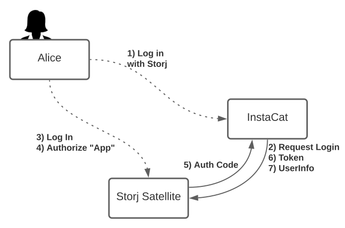
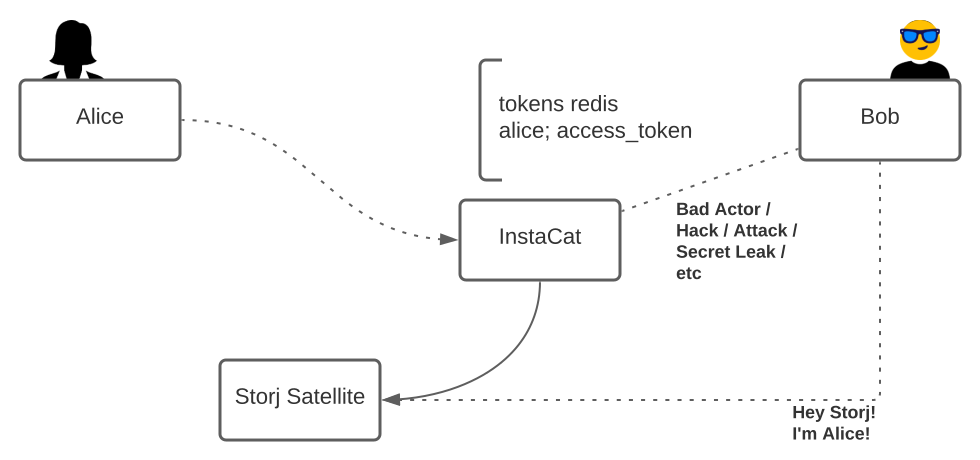
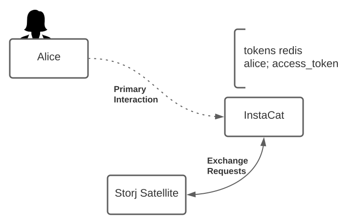

# Log In with Storj

## Background

As we continue to grow, we need to enable engineers to build distributed web applications on top of the Storj platform.
As a third party application developer, I rarely want to deal with user management. I often rely on third party services
(like Google, GitHub, etc) to handle authentication for me. Beyond authentication, this type of integration often allows
my application to access information from the authenticating service on the user's behalf. For example, if I were to log
in with GitHub, the requesting application can be granted permissions to read private repositories, packages, and more.

## Abstract

In this document, I describe how we can turn the Satellites into an OpenID Provider. [OpenID Connect][] (or OIDC)
provides a slim identity layer (authentication) on top of [OAuth2][] (authorization). This allows new applications to be
developed against the core of the Storj platform, using well know, well-supported, best practices. By integrating with
OIDC, we ultimately put the control over ones identity in hands of our end users. Instead of passing around and storing
access grants, applications and satellites can negotiate time-bound access and refresh tokens on behalf of authenticated
end users.

To help solidify the concepts in this review, I've included diagrams to illustrate interactions between Storj, InstaCat
(a fictional cat photo sharing service built on top of Storj), users (like Alice and Bob), and other various/nefarious
actors.

[OpenID Connect]: https://openid.net/connect/

[OAuth2]: https://oauth.net/

## Design

As stated in the abstract, OIDC provides a slim identity layer on top of OAuth2. OAuth2 is often used to mint and permit
access to applications on behalf of an end user (i.e. it handles authorization). While many engineers may not know the
specifics of how OAuth2 works, its likely something that they've interacted with. Ever log into an app with Google,
Salesforce, or AzureAD? All OAuth2, and more specifically OIDC. While there are a few different "flavors" of OIDC, the
[core][] functionality is rather minimal and additional capabilities can always be added later on.

For the MVP of this feature we will look at implementing the minimum feature set to allow users to log in using their
Storj account. Before getting into the details of how things will change, let us first understand the sequence of
events. The diagram below (along with accompanying text) details how the various party's interactions.

[core]: https://openid.net/specs/openid-connect-core-1_0.html



1. Alice (an end user) navigates to InstaCat and is asked to log in with their Storj account.
2. After clicking the log in button, they're redirected to Storj.
3. Alice logs into Storj using their username and password (and MFA).
4. After logging in, Alice is asked to grant InstaCat permission to manage objects in Storj on Alice's behalf.
5. Once approved, Storj returns a single-use authentication code back to the InstaCat application
6. InstaCat uses the returned auth code to obtain an access token (and optional refresh token) from Storj
7. Finally, InstaCat uses the access token to obtain the user information (and interact with other various APIs).

### Applying to Storj

Now, let us consider how to apply this to Storj. In Storj, everything you need to read/write an object is called an
access grant. Access grants consist of a satellite id, satellite host, satellite port, API key (serialized macaroon),
encryption key, and encryption algorithm. This is best illustrated by Marton's [The zoo of the secrets][]:


[The zoo of the secrets]: https://forum.storj.io/t/illustration-the-zoo-of-the-secrets/15669/6

The idea is to try and fit our Storj shaped peg into the OAuth2 shaped hole.

**Authorization Scopes**

In addition to the custom scopes listed below, OpenID Connect requires us to provide `openid`, `profile`, and `email`.
These scopes grant the requesting party access to information about the user associated with the token.

**What is the requesting application allowed to do?**

These are the permissions that third-party applications are allowed to request from Storj.

- `object:list` - optional, allows listing object data
- `object:read` - optional, allows reading object data
- `object:write` - optional, allows writing object data
- `object:delete` - optional, allows deleting object data

**What are they allowed to do it to?**

These additional scopes are added by the authenticating user to restrict an applications access to a single project and
bucket.

- `project:<project>`  - required, scopes operations to a single project
- `bucket:<name>`      - required, scopes operations to a selected bucket
- `key:<algo>:<key>`   - required, communicates the encryption key to be used for communication

**Access Tokens, Refresh Tokens, and API Keys**

OAuth2 and OIDC do not require that access and refresh tokens be formatted a specific way (i.e. JWTs). In OAuth, access
tokens are short-lived tokens that allow an application to act on behalf of an end user for a limited period of time
(i.e. a bearer token). Refresh tokens are optionally issued, allowing applications to refresh the user identity for some
longer period of time. The idea is to minimize the amount of time that a given token is valid for. Consider the
following diagram that shows how a malicious attacker might obtain an access token from a third-party application or
even from the user's browser cache.



Due to the lack of specificity in the format of access and refresh tokens, this allows us to conveniently plug in our
macaroons (especially since there are many similarities between them and JWTs). One nice element that we get from
macaroons is the ability to generate subsequent access tokens from the refresh token. Consider the following Golang
snippet that demonstrates this:

```go
apiKey, _ := macaroon.NewAPIKey(projectSecret)
apiKey, _ = apiKey.Restrict(grants)              // explicit grants from the consent page

refreshToken, _ := apiKey.Restrict(refreshTokenTimeWindow) // include a nonce !important
accessToken, _ := refreshToken.Restrict(accessTokenTimeWindow) // include a nonce !important
```

When a valid refresh token is presented for renewing, we can skip some expensive API calls and simply mint a new access
token from the provided refresh token. The newly minted access token can then be used to communicate with the Storj API.

**Encryption Key and Algorithm**

One thing that our workflow needs to account for that OIDC and OAuth2 do not explicitly detail is the handoff of an
encryption key without exposing the root a passphrase. One way that this can be done is when Alice is authorizing
InstaCat to manage objects in Storj in step 4 above, we require that they enter the required passphrase before
submitting the form. On submit, we can use that passphrase to generate an encryption key and pass that back to the
server to ensure the passphrase is never exposed to the Storj ecosystem. The resulting key and algorithm can be cached
along with the profile or "session" data so when InstaCat requests the user information in step 7, they can obtain the
associated encryption key.

<!--
    !important challenge:
    what if, the authorized application is a remote server? the user no longer has end to end encryption. The
    application integrating with Storj could decrypt the stream before the data reaches it's final destination. This
    is something we can probably consider "out of scope" as that seems beyond our responsibility.
-->

**Satellites**

At this point, we have API Keys (access tokens), an encryption key and algorithm, the only remaining element is how to
handle the satellites. This has arguably been one of the harder parts about the design. In order for client applications
to integrate with Storj, they need to account for non-standard deployments of Storj (i.e. not just us1.storj.io, etc).
Perhaps a good analogy here is GitLab. Sure, you can log in and develop code on gitlab.com, but it's also possible to
run and host GitLab yourself on another custom domain. Applications integrating with GitLab need to account for this as
they develop applications against it.

Given that, we can assume that the client already has the satellite address since applications need to register with
satellites in order to obtain a client id and client secret. As a result, applications should have all the information
that they need in order to issue API requests.

Once a client completes the OAuth workflow, they can perform requests on behalf of the end user for as long as the token
is valid. To Alice, they're just interacting with this new InstaCat application, but they own all their data.



## Rationale

_Why OpenID Connect?_

OpenID Connect has become a fairly strong (and consistent) standard for handling user authentication. Google Accounts,
Salesforce, and Azure AD v2 are prominent examples out in the wild today. While there are many other types of mechanisms
out there, this one immediately came to mind because of its ubiquity across major platforms. For solutions that don't
implement OIDC, [dex][] has become a popular tool of choice that can convert many types of authentication flows into a
provider. I've also seen [hydra][], which seems to allow companies to bolt and OIDC provider onto the side of an
existing login workflow.

In the end, making the decision to go with OIDC seemed like the right thing to do given its rather extensive use and our
longer term vision of a more decentralized web.

[dex]: https://github.com/dexidp/dex/

[hydra]: https://github.com/ory/hydra

## Implementation

### Satellite API Changes

The `go-oauth2` provides a good framework for us to build upon. Even if we don't end up using the bit of code that they
provide, we can build upon their core elements.

First, we can provide our own storage driver implementations through the `ClientStore` and `TokenStore`
[interfaces](https://github.com/go-oauth2/oauth2/blob/master/store.go). These implementations will store clients and
access tokens in Cockroach along with much of the rest of our data (for now <sup>1</sup>).  Since we will be adding 
these values to the database for now, we will need additional dbx models for each. We should be able to model these 
after the provided [models](https://github.com/go-oauth2/oauth2/blob/master/model.go) as a start. 

```
// client stores information about known clients developed against stroj.
model client (
    key id

    field id         blob
    field secret     blob    // encrypted
    field domain     text
    field user_id    blob
)

// codes are single use tokens that are handed off to the third party applications.
// they're exchanged for an access_token (and maybe a refresh_token).
// they can only be claimed once.
model code (
    key code

    index ( fields user_id )
    index ( fields client_id )

    field client_id     blob
    field user_id       blob
    field scope         blob    // encrypted (contains an encryption key)
    field redirect_uri  text

    field challenge            text
    field challenge_method     text

    field code                 blob
    field created_at           timestamp
    field expires_at           timestamp
    field claimed_at           timestamp ( nullable )
)

// a token can be an access or refresh token
model token (
    key token
    index ( fields user_id )
    index ( fields client_id )

    field client_id     blob
    field user_id       blob
    field scope         blob    // encrypted (contains an encryption key)

    field kind          int     // access or refresh
    field token         blob    // encrypted macaroon
    field created_at    timestamp
    field expires_at    timestamp
)
```

<sup>1</sup> _there's a question of whether a CP system like Cockroach is appropriate for access/refresh token storage. 
We can investigate this later on down the line as our current use cases are limited._

### Console Changes

In the Storj Satellite Console, we will need a new login workflow. This workflow comes with one new page, a consent
page. When a user initiates an OAuth/OIDC flow:

1. They are sent to the login page.
   * If the user is already logged in, then they are sent directly to the consent form.
2. The user enters their method of authentication.
   * This is currently a username and password with Storj.
   * Eventually, users may be able to log in with other services providers.
3. Once logged in, the user may be presented with their MFA screen if its enabled.
4. Once authenticated, the user is presented with the consent form for granting a third party application access to a 
   Storj bucket.
   * This page contains a lot of information.
     * Allows users to review various permissions being granted (read, write, list, delete).
     * Allows users to select a project and bucket they want to grant the application access to.
       * A user _may_ want or need to create a new project or bucket.
     * Allows users to enter their passphrase for the bucket so the requesting application is never given direct access 
       to the passphrase.
   * Once reviewed and all information is provided, the user submits the form granting consent 
5. After reviewing the various permissions, selecting their required project and bucket, entering 

### Admin Changes

On the admin server, we'll want to add a new API endpoint for creating new clients. This operation happens once anytime
someone sets up a new application. Longer term, we will eventually want a place in the console to manage these clients.
For the time being, a handful of admin endpoints will be sufficient.

- `POST /oauth/clients` creates an oauth client in our database.
- `DELETE /oauth/clients/{client_id}` deletes an oauth client from our database.

## Wrap up

Mya Pitzeruse will archive this blueprint when completed.

No documentation will need to be provided currently, but should we open this functionality up wider, we will want to
create a self-service portal for users to be able to submit their application.

## Open issues

- [OIDC Prototype](https://github.com/storj/storj/pull/4248)
- [GitHub Review](https://github.com/storj/storj/pull/4236)
- [Gerrit Review](https://review.dev.storj.io/c/storj/storj/+/6212)
