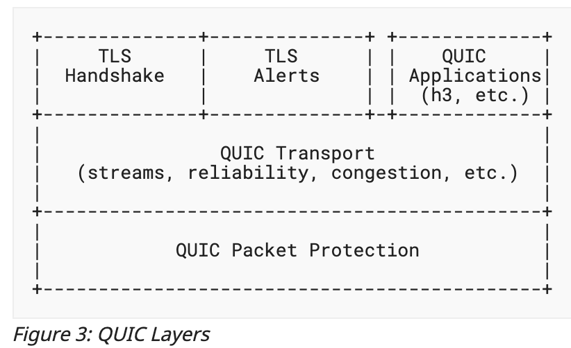

# QUIC

## Abstract

The Storj Network is spending a lot of time dialing nodes due to the high number of round-trips during the SSL negotiation process. Here we describe a solution to reduce round trips.

## Background

Currently our Upload and Download operations are being affected by the number of round-trip times (RTT) during the Node dialing.

Download Dial times takes ~300ms and Upload ~900ms (all regions/endpoints). It's mostly caused by the number of RTTs for every single connection. See this (gist)[https://gist.github.com/BlackDuck888/6f3df8d264f58e63a21fcdcd9f82303e] with code of how numbers were obtained.

The Storj network currently uses TCP with TLS. The current flow of dial node is:
1. make a TCP connection ([code](https://github.com/storj/common/blob/master/rpc/connector.go#L70))
2. TLS handshake ([code](https://github.com/storj/common/blob/master/rpc/connector.go#L79))

Each step is done sequentially and is a full round trip between client-server. This means we need 2 round trips before we can start transferring data. The proposal here is to replace TCP with QUIC network protocol to reduce the number of round trips to 1 (or 0 down the road).

The [QUIC transport protocol](https://tools.ietf.org/html/draft-ietf-quic-transport-29) reduces that number of round trips with connection establishment and also reduces overall transport latency with multiplexing. QUIC is over UDP and encrypts all headers and payloads by default. QUIC handshake only takes a single round-trip between client and server, improved from the usual two round-trips required for the TCP and TLS handshakes. Therefore using the QUIC protocol in the Storj network will reduce the number of round-trip times (RTT) improving performance dialing nodes.

Ref: https://tools.ietf.org/id/draft-ietf-quic-tls-31.html#name-protocol-overview

## Design

Add support for QUIC network protocol in the Storj network. 

#### Security
WIP

#### Testing - Unit and Performance
WIP

#### Infrastructure Changes to TLS and certificates
WIP

#### Rollout Plan/Backward Compatibility
WIP

## Rationale

- Advantages:
  - Using QUIC will allow us to reduce the connection by at least 1 round trip.

- Disadvantages:
  - The [go-quic](https://github.com/lucas-clemente/quic-go) library is still relatively new and not stable yet.
  - O-RTT isn't able to be used (due to replay atacks) and therefore reducing the performance gain by QUIC.

## Implementation

- Prior to making quic-specific changes in common/rpc we need to refactor the package to better separate the dialer and transport mechanisms
- Implement QUIC using quic-go library
- Add unit tests for rpc networking in storj/common repo
- Create rollout plan
- Add QUIC to Satellite
- Create performance tests
- Confirm that the QUIC implementation lowers the the node dial latency (from previous 300ms/900ms for Dowload dial and upload)
- Add QUIC to Uplink
- Add QUIC to Stoargenode
- Make any necessary infrastructure changes (i.e. TLS certs)

## Alternatives Considered

- [Noise Protocol](https://review.dev.storj.io/plugins/gitiles/storj/storj/+/refs/changes/02/1802/8/docs/blueprints/noise-protocol.md)
POC code for noise protocol: https://github.com/storj/noise-benchmark/

- TLS 1.3 0-RTT. The reason we are not using TLS 1.3 0-RTT is that it's vulnerable to replay attack.
More info: https://blog.cloudflare.com/introducing-0-rtt/ and https://www.rfc-editor.org/rfc/rfc8446.html#page-150

- O-RTT QUIC. We are not using 0-RTT for QUIC since it appears to be the same as TLS 1.3 0RTT. See the [IETF replay attack description](https://tools.ietf.org/id/draft-ietf-quic-tls-31.html#name-replay-attacks-with-0-rtt). Even without 0-RTT we still reduce one RTT by avoiding the TCP handshake.

## Open issues

- We have merged a few PRs into `go-quic`, but they are not released yet. We need to find out what the release cycle is and when that will be available? In the meantime, should we develop our storj QUIC implementation with a commit off master of `go-quic` to include our PRs? (refence to PRs: [1](https://github.com/lucas-clemente/quic-go/pull/2814), [2](https://github.com/lucas-clemente/quic-go/pull/2798))
- How much data can you send in a packet on a given QUIC connection?
- How is this scenario handled: someone opened a connection, and its terminated in the middle, how is that handled and is the connection closed gracefully?
- Will the TLS cert setup need to change in the current Kubernetes infrastructure?
