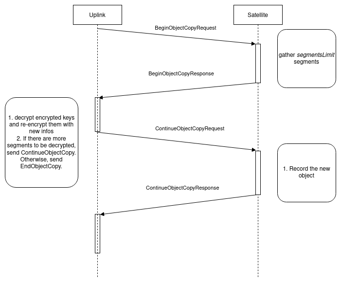

# Server-side Copy

## Abstract

This document describes how we will implement server-side copy.

## Background

### What do we mean by _server side copy_:

- it should be an atomic operation.
- there are no decrypt/encrypt operations: we don't change the encryption parameters. We may need to re-encrypt the object's metadata.
- only committed objects can be copied
- we want to avoid downloading and reuploading
- the most common scenario in S3 is for server-side move, implemented in two steps:
    - server-side copy of the source object to the destination object
    - delete the source object.
The expectation for clients is that server-side move is a fast operation, so we should try to implement server-side copy as fast as possible too.
The impact on operations on original objects should be minimized.

### How it works on AWS

- Atomic server side copy is limited to objects below 5GB in size.
- For objects between 5GB and 5TB (max object size), the Upload Part-Copy API must be used.
- _read_ access to the source object, _write_ access to the destination bucket.
- metadata can be preserved or replaced
- copy to the same location is the recommended way of changing the metadata of an object.

At some point, we will implement `upload-part-copy`, so we need to take this into account in the design. upload-part-copy allows the user to define byte ranges.

## Design

Source and destination objects must have the same expiration date, as the source and destination objects share the same pieces on the storage nodes.
Storage nodes are aware of a piece expiration date, and routinely delete the expired ones.

In our database, we keep the following information about an object (`objects` table):
- `ProjectID, BucketName, ObjectKey, Version, StreamID (ObjectStream)`
- `CreatedAt, ExpiresAt`,
- `Status (Pending/Committed), SegmentCount`,
- `EncryptedMetadataNonce, EncryptedMetadata, EncryptedMetadataEncryptedKey`,
- `TotalPlainSize, TotalEncryptedSize, FixedSegmentSize, Encryption, ZombieDeletionDeadline`.

And the following information about its segments (segments table):
- `StreamID, Position` (`SegmentPosition` = part + index in part)
- `CreatedAt, RepairedAt, ExpiresAt`,
- `RootPieceID, EncryptedKeyNonce, EncryptedKey`,
- `EncryptedSize, PlainSize, PlainOffset, EncryptedETag`,
- `Redundancy`,
- `InlineData, Pieces`

Each `Piece` is a reference to piece on a storage node. It contains the piece number and the nodeID of the storage node holding the data.

The general idea is that the satellite copies the row corresponding to the copied object and adapt it to fit the newly created object. It needs to adjust:
- `BucketName, ObjectKey, StreamID`
- `CreatedAt` (`ExpiresAt` cannot be changed, as the storage node holding expired pieces will delete them)
- `EncryptedMetadataNonce, EncryptedMetadata, EncryptedMetadataEncryptedKey`.

It also needs to copy the corresponding segments (same operation than the one done in upload-part-copy). It needs to adjust:
- `StreamID`
- `CreatedAt`
- `EncryptedKeyNonce, EncryptedKey`

If it copies an inline segment, it just copies `InlineData`.

The remote pieces of a segment are not copied, but we keep track of the number of segments referencing them. The amount of data we store on the storage nodes will be less than what we get if we consider the sum of sizes advertised in the segments table.

`ExpiresAt` cannot be changed, as expiration date of the original segment is used by storage node when deciding if it should delete pieces.

`RepairedAt` should be retrieved from the original segment.

If the source object is deleted between calls to `BeginCopyObject` and `FinishCopyObject`, a `FailedPrecondition` error is thrown.

### Reference Counter

Table `segments` contains a `ancestor_stream_id`. It is empty for original segment. For copied segments, it contains the `stream_id` of the original segment. Table `segments` also contains a `reference_counter` integer counting the number of segments having `stream_id` as `ancestor_stream_id`.

In this solution, `ancestor_stream_id` has to be read at each download, which could cause performance issues if this information was kept in another table.

3 segments `A`, `B`, and `C` with the corresponding stream_ids `A.stream_id`, `B.stream_id` and `C.stream_id`.
Segment `B` is a copy of segment `A`. Segment `C` is a copy of segment `B`.

#### Upload

- _`A` is uploaded_

| `segment`   |      `counter`    |  `ancestor_stream_id` |
|----------|:-------------:|----------:|
| `A` |   0   |   - |

- _`B` is uploaded_

| `segment`   |      `counter`    |  `ancestor_stream_id` |
|----------|:-------------:|----------:|
| `A` |   1   |   - |
| `B` |   0   |   `A.stream_id` |

If we use a reference list, we would have to add `B.stream_id`  to `A.reference_list`.

- _`C` is uploaded_: we have two choices: we can mark `C` as a copy of `B`, or resolve links, and mark `C` as a copy of `A`.

| `segment`   |      `counter`    |  `ancestor_stream_id` |
|----------|:-------------:|----------:|
| `A` |   2   |   - |   - |
| `B` |   0   |   `A.stream_id` |
| `C` |   0   |   `A.stream_id` |

If we use a reference list, we would have to add `C.stream_id`  to `A.reference_list`.

#### Download

When wanting to download a segment, we first check the `ancestor_stream_id`. If it not set, `remote_alias_pieces` is used. Otherwise, `remote_alias_pieces` of segment `ancestor_stream_id` is used.

For a segment that is not a copy, only the standard query is used. A second query for retrieving `remote_alias_pieces` is run only if `ancestor_stream_id` is set.

#### Deletion

Let's consider the deletion of each segment at this point:
- `B` or `C` is deleted:
  - with a reference counter: `A.counter` (`ancestor_stream_id` of `B` and `C`) is decreased
  - with a reference list: `stream_id` of `B` or `C` is removed from `A.reference_list`
- `A` is deleted (original segment):
  - with a reference counter: as `A`'s counter is not zero, the first segment with `ancestor_stream_id = A` becomes the original segment. Its reference counter is set to `A.counter-1`. `remote_alias_pieces` is copied.
  - with a reference list: `A.reference_list` is not empty, the first `stream_id` in `A.reference_list` becomes the original segment. Its reference list is set to `A.reference_list` minus `(stream_id, position)`

In the most common case we foresee (_i.e._ copy `A` to `B` and right after, delete `A`):
- copy: create row for segment `B`, reference counters will be:

| `segment`   |      `counter`    |  `ancestor_stream_id` |
|----------|:-------------:|----------:|
| `A` |   1   |   - |
| `B` |   0   |   `A` |

- deleting `A`:
  - with reference counter: look for `1` copy of `A` to update the `ancestor_stream_id` (We want to avoid to have an index on `ancestor_stream_id`, this could lead this query to be slow).
  - with reference list: we don't have to make another query, we just use the `stream_id` in `A.reference_list`

Having a reference list speeds up the delete operation of our predicted most common use case. It could also ease debugging in case something goes wrong.

### Reference table

We have a similar problem with reference counter and reference list in segments table. Both need an update of all children's `ancestor_stream_id` when the original segment is deleted.

This scan can be avoided by adding a `segment_copies` table that would keep track of copied segments' ancestor. It contains `(stream_id, ancestor_stream_id)` with primary key on `stream_id`

#### Upload

When creating a copy `B` of segment `A`, an entry `(B.stream_id, A.stream_id)` is created.

When creating a copy `C` of segment `B`, an entry `(C.stream_id, A.stream_id)` is created.

#### Download

When downloading a segment, after querying the `segments` table:
- if the segment is not a copy of a remote segment (`remote_alias_pieces` not null or `inline_data` not null or zero `encrypted_size`) it is processed as it currently is.
- if it is a copy of a remote segment (no `remote_alias_pieces` and no `inline_data` and non-zero `encrypted_size`), the `ancestor_stream_id` is read from the reference table, and the corresponding `remote_alias_pieces` are retrieved from the segments table.

#### Deletion

When deleting original segment `A`, the following is done:
- a look-up for elements with `ancestor_stream_id = A.stream_id` is performed.
- if such elements exist (it does in our example):
    - the first entry with `ancestor_stream_id = A.stream_id` gives the stream_id that will replace `A.stream_id` as `ancestor_stream_id` in the `segment_copies` table. In our example, it would be `B.stream_id`.
    - Update the necessary fields for the new original segment (`B`) in the `segments` table (size informations, `RepairedAt` and `ExpiresAt`, `remote_alias_pieces`)
    - replace `A.stream_id` by `B.stream_id` in the `ancestor_stream_id` column of the `segment_copies` table.
- segment A is deleted from the segments table

This full scan table could slow down deletes, especially for segments that have not been copied. We need at least an index on `ancestor_stream_id`. Another solution would be add a column to the segments that indicates if the segment has been copied.

In the most common case we foresee (copy/delete), this means we will have:
- one lookup with index, one insert in the `segments` table (create copy)
- one insert in the `segment_copies` table (create copy)
- one lookup (on an index column) in the `segment_copies` table, to find that the only existing copy becomes the original (delete original)
- one update in the `segments` table (delete original)
- one delete in the `segments` table (delete original)

We choose to implement the reference table. This way, we don't need to modify the `segments` table, and we keep track of all copy references, so that debugging, should it be needed, will be simplified. This solution should not cause overhead for downloading an original object (has it been copied or not). It will have some overhead for deleting an original segment. If it has not been copied, a full scan of the reference table will be necessary, as we will have to check that it has not been copied.

 We limit the number of objects an object can be the `ancestor_stream_id` of to `100` as a way to limit the growing of the `segment_copies` table.

### Messages and Service

Copy operation will behave a lot like move operation, except that we don't modify the source object and its segments.
- Uplink sends a `ObjectBeginCopyRequest`.
- Satellite responds with `ObjectBeginCopyResponse` containing all segments encrypted keys
- Uplink re-encrypt keys with the new object key, sends a `ObjectFinishCopyResponse`
- Satellite creates new segments with the new encrypted keys
- Update the reference table to keep track of the link between the source stream_id and the destination stream_id.

__ObjectBeginCopyRequest__
- contains `Bucket, EncryptedObjectKey, NewBucket, NewEncryptedObjectKey`

__ObjectBeginCopyResponse__
- contains `StreamId`, `EncryptedMetadataKeyNonce`, `EncryptedMetadataKey`, an array of `Position, EncryptedKeyNonce, EncryptedKey` of all segments, and `EncryptionParameters`.

__ObjectFinishCopyRequest__
- contains `StreamId`, `NewBucket`, `NewEncryptedObjectKey`, `NewEncryptedMetadataKeyNonce`, `NewEncryptedMetadataKey`, `NewEncryptedMetadata` an array of new `Position, EncryptedKeyNonce, EncryptedKey` of all segments.

__ObjectFinishCopyResponse__
- Object's metadata

### Impact on other services

- Garbage Collection:
    - No impact. Copied segments have no `remote_alias_pieces`, so no piece references to add to the bloom filter.
- Audit/reputation
    - Audit should ignore segments with a set `ancestor_stream_id
- Data Repair:
    - No impact. The checker, responsible for identifying injured segments, does not consider segments with no `remote_alias_pieces`.
- Graceful Exit:
    - No impact. Graceful exit is done at the pieces level. As copied segments hold no piece, this does not impact the service.
- Metainfo > Expired Deletion:
    - no impact. Copies have the same expiration time as originals. Expired objects cannot be accessed by the user.
- Accounting / Tally:
    - no impact - we bill copies as original objects.
- Metrics:
    - we should add the metric `req_copy_object` in metainfo endpoint to measure the use of this functionality.

The first implementation can handle only objects with a number of segments that can be handled in a single request (e.g. 10000). Copying objects with a larger number of segments should be rejected.

As a next step, we can handle copying objects with a large number of segments by keeping partial results of copy in a separate database table. The final copy operation will be applied when all new encrypted keys will be collected. For such operation `BeginCopyObject` method should return a unique operation identifier which should be used with `FinishCopyObject`. This will give us the ability to safely link together begin and finish requests. Keeping partial results should be limited by time as the user can start copy operation but not necessarily finish it (e.g. cancellation, crash during operation).

## Implementation
- migration step for adding `segment_copies` table with columns `stream_id, ancestor_stream_id`
- protobuf for `BeginCopyObject` and `FinishCopyObject` in common
- add endpoint `BeginCopyObject` to metainfo - the corresponding tests should check that:
    - an error is returned if the object does not exist, or is in pending state.
    - if the number of segments is above the maximum number of segments, an error is returned
    - the correct infos are returned
- add endpoint `FinishCopyObject` to metainfo - the corresponding tests should check that:
    - an error is thrown if called on a deleted object
    - there is a mismatch in the number of segments in FinishCopyObject and the number of segments of the source object.
    - throw an error if there is an overflow of the reference counter of the source object.
- add method in uplink public API `CopyObject(oldBucket, newBucket, oldName, newName)`
- adapt `ListSegments`

Later we can:
- _assess impact on the satellite performances_
- derive the destination `stream_id` from the source `stream_id` to get better performances.

## Performance trade-offs
As stated earlier, we are going to benchmark different solutions. When doing so, we will have the following considerations:
- the solution should have as little impact as possible on operations on a segment that has not been copied.
- we want to minimize impact on downloads and then uploads
- we think the most common use case will be copy of an object, followed by the deletion of the original object. If this is the case, the percentage of copies should be small, and we should not have copies of copies most of the time.

The test plan will be a separate document (see https://github.com/storj/storj/pull/4317) and will be available under `docs/testplan/server-side-copy-testplan.md`.

## Open issues
- do we add a column to the `segments` table or query the `segment_copies` table each time we need to know if a segment is an original (i.e. it is referenced by other segments)?