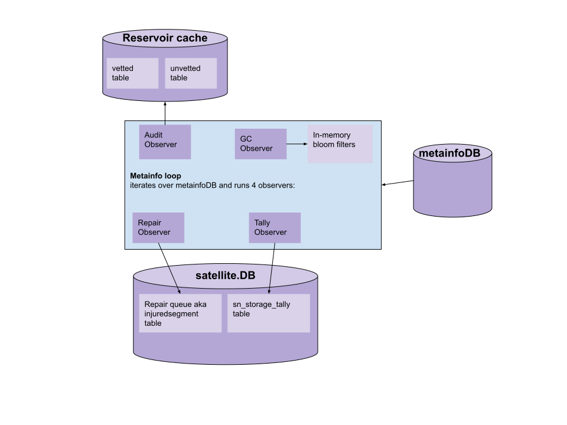
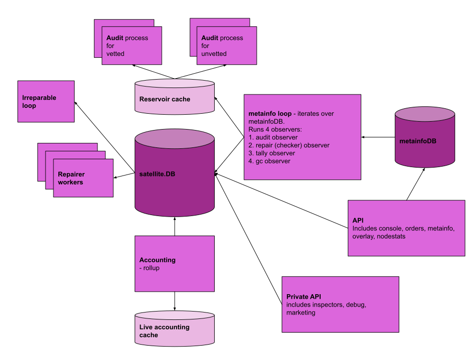

# Satellite Service Separation

## Table of Contents
1. [Abstract](#abstract)
2. [Background](#background): Current Satellite Design
3. [Design](#design)
4. [Rationale](#rationale)
4. [Implementation](#implementation)

## Abstract

The goal of the design doc is to describe the work necessary to make the Satellite horizontally scalable.

## Background

Currently all Satellite services run as a single process. While this is great for development, this is bad for scaling.

### Current Satellite design

Currently the Satellite runs as a single process made of up the following parts:

#### overlay
The overlay maintains critical information about nodes in the network (via the nodes table in satellite.DB). One important use of overlay is to help select which storage nodes to upload files to.

#### metainfo
Metainfo is responsible for all things related to the metainfo stored for each file on the network. The metainfo system is currently composed of the following parts: 

1) metainfo database, which stores data about buckets, objects and segments.

2) metainfo loop which iterates over all the data in metainfo database.

3) metainfo endpoint which creates the public RPCs for creating/deleting metainfo.

4)  metainfo service, which ensures proper access to metainfo database and simplifies modification for other services.

#### orders
Orders is responsible for creating/managing orders that the satellite issues for a file upload/download. Orders are used to keep track of how much bandwidth was used to upload/download a file. This data is used to pay storage nodes for bandwidth usage and to charge the uplinks. See this [doc on the lifecycle of data](https://github.com/storj/docs/blob/master/code/payments/Accounting.md#lifecycle-of-the-data) related to accounting which includes orders.

#### audit
Audit performs audits of the storage nodes to make sure the data they store is still retrievable. The audit system is currently made up of an audit service that runs on an interval performing audits on a segment at a time. The result of the audits are reported to the overlay service to store in node table in satellite.DB. See [docs on audit](https://github.com/storj/docs/blob/master/code/audits/audit-service.md) for more details.

#### repair
Repair searches metainfo for injured segments and adds them to the repair queue. Repairer picks segments from queue and tries to fix them. When repair fails, then the segment is added to irreparable database. The repair system is currently made of 4 parts and 2 DBs (db tables). The 4 parts are 1) repair observer (contains ReliabilityCache) 2) irreparable loop 3) repairer 4) repair queue. The 2 DBs are 1) injuredsegment (repair queue) table in satellite.DB 2) and irreparabledb table in satellite.DB 

#### garbage collection (GC)
GC iterates over the metainfo and creates a list for each storage node. It sends these list to storage nodes, who can delete all pieces missing from the list. See [GC design doc](https://github.com/storj/storj/blob/master/docs/design/garbage-collection.md) for more details. 

#### accounting
Accounting calculates how much uplinks use storage and how much storage nodes store data. See [docs on accounting](https://github.com/storj/docs/blob/master/code/payments/Accounting.md) for more details.

#### console
Console provides the web UI for the Satellite where users can create new accounts/projects/apiKeys needed for uploading/downloading to the network.

#### mail
`mail` service sends emails. Currently it's used by console UI.

#### marketing
Marketing provides a private web UI for the the marketing admins for referral program.

#### nodestats
Nodestats allows storage nodes to ask information about themselves from the satellite. For example, it can ask for stats on reputation and accounting storage usage.

#### inspectors
Inspectors allow private diagnostics on certain systems. The following inspectors currently exist: overlay inspector, health inspector, and irreparable inspector.

#### kademlia
Kademlia, discovery, bootstrap, and vouchers are being removed and not included in this doc. See [kademlia removal design doc](https://github.com/storj/storj/blob/master/docs/design/kademlia-removal.md) for more details.

#### GRPC endpoints
The Satellite has the following GRPC endpoints:
- Public: metainfo, nodestats, orders, overlay (currently part of kademlia, but may be added here)
- Private: inspectors

#### HTTP endpoints
The Satellite has the following HTTP endpoints:
- Public: console
- Private: marketing admin UI, debug

#### databases
All services (except version) make connections to the satellite.DB. Five services rely on metainfo service to access the metainfoDB, this includes inspectors, accounting, audit, repair, and garbage collection.

See these docs for details on current database design: 
- https://github.com/storj/docs/blob/master/code/Database.md#database
- https://github.com/storj/docs/blob/master/code/persistentstorage/Databases.md

#### limitations
The current items that prevent Satellite horizontal scaling include:
- live accounting cache is currently stored in memory which cannot be shared across many replicas
- in-memory/locally stored databases. This includes revocationDB and the devDefaults for satellite.DB and metainfoDB.
- potentially things that use mutexes, sync.Mutex or sync.RWMutex (these don't prevent, but indicate that there might be shared state)
- set on database, i.e. non transactional db changes
- ?

## Design

The plan is to break the Satellite into multiple processes. Each process runs independently in their own isolated environment. Ideally, each process can be replicated and load balanced. This means they need to share access to any persistent data.

### New satellite processes

Currently there is only one Satellite process. We propose to add the following processes:

#### satellite api
The satellite api will handle all public GRPC and HTTP requests, this includes all public endpoints for nodestats, overlay, orders, metainfo, and console web UI. It will need all the code to successfully process these public requests, but no more than that. For example, if the console needs the mail service to successfully complete any request, then that code should be added, but make sure to only include the necessary parts. There shouldn't be any background jobs running here nor persistent state, meaning if there are no requests coming in, the satellite api should be idle.

#### private api
The private api process handles all private GRPC and HTTP requests, this includes inspectors (overlay, health, irreparable), debug endpoints, and the marketing web UI. Open question: do we need the inspectors, if not should they be removed?

#### metainfo loop and the observer system
The metainfo loop process iterates over all the segments in metainfoDB repeatedly on an interval. With each loop, the process can also execute the code for the observer systems that take a segment as input and performs some action with it. The observer systems currently include: audit observer, gc observer, repair checker observer, and accounting tally.

The audit observer uses the segments from the metainfo loop to create segment reservoir samples for each storage node and saves those samples to a reservoir cache. Audit observer currently runs on a 30s interval for the release default setting. See [audit-v2 design](https://github.com/storj/storj/blob/master/docs/design/audit-v2.md) for more details.

The repair (checker) observer uses the segments from the metainfo loop to identify segments that need to be repaired and adds those injured segments to the repair queue. The repair check currently has a `checkerObserver.ReliabilityCache`, this should be ok to stay in-memory for the time being since we plan on only running a single metainfo loop. The repair observer currently runs on a 30s interval for the release default setting.

The garbage collector (GC) observer uses the segments from the metainfo loop to create bloom filters for each storge node. The bloom filters contain all the pieceIDs that the storage node should have. The bloom filters are stored in-memory then sent to the appropriate storage node. Keeping the bloom filters in-memory is ok for the time being since we don't plan to run more than a single replica of the metainfo loop service. The GC observer currently runs on 5 day interval for the release default setting.

The tally observer uses the segments from the metainfo loop to sum the total data stored on storage nodes and in buckets then saves these values in the tables `storagenode_storage_tally` and `bucket_storage_tally` in the satellite.DB database.

The following diagram outlines the metainfo loop with the 4 observer:

***

***

#### irreparable loop
Lets get rid of the irreparable loop. For one, we never expect there to be files that can't get repaired. In the off chance there are, lets just add the file back to the repair queue and try again later, but lets keep track of how many times we've tried.

#### repair workers
The repair worker executes a repair for an item in the repair queue. We want to work through the repair queue as fast as possible so its important to be able to dispatch many workers at a time.

#### audit workers
The audit process should be able to run many audits in parallel. See the [audit-v2 design doc](https://github.com/storj/storj/blob/master/docs/design/audit-v2.md) for updates to the audit design.

#### accounting
The accounting process is responsible for calculating disk usage and bandwidth usage. These calculations are used for uplink invoices and storage nodes payments. Accounting should receive storage node total stored bytes data from the tally observer running with the metainfo loop.

#### uptime
The uptime process will be responsible for pinging nodes we haven't heard from in a while and updating the overlay cache with the results.

***

The following diagram shows the above proposed design:

***

## Rationale

#### metainfo loop and observer system
For database performance reasons we should only have one thing looping over the metainfo database. This is why we are combining everything into the metainfo loop observer system. There is no sense in having multiple different processes all redoing the work of iterating over the database and parsing protobufs if lots of things need to do that same work over and over. We could add functionality to this version service so that all binaries running in the new satellite system check in and provide software version compatibility details. There has been discussion about making the audit and GC observers run on different loops, but for performance concerns, its been decided to run all observers on the same metainfo loop (though GC will run less frequently). 

Keep in mind it's important for the GC observer that we hit every single item in the metainfoDB, otherwise the GC bloom filters could be inaccurate which could cause storage nodes to delete live data.

For the metainfo loop and observer system its not critical to have high availability for these systems in the short term, therefore its ok to have all these observers depend on a single metainfo loop process.  If the need arises to have multiple concurrent metainfo loops then we can address those specific needs as they come up. In the worst case scenario, if the metainfo loop goes down we don't expect any overall satellite system downtime, however there may be metainfo loop downtime until its fixed and back up. This should be fine for small periods of time.  We should figure out what is an acceptable amount of downtime for metainfo loop should it occur.

#### satellite api

For creating the satellite api, there are two options for design. One, a single process containing all public GRPC/HTTP endpoints **and** all code necessary to process any request to those endpoints. Or two, a single process that contains all public GRPC/HTTP endpoints but does **not** contain the code to process requests, instead the api would act as a proxy passing along requests to the correct backend services. Here we will do the first option since it is less complex and it fulfills our need to run replicas to handle lots of traffic. In the future we can migrate to option two should the additional complexity be needed to satisfy some other need.

#### version

We need a way for all these new satellite binaries to perform a version compatibility check. In the short term the version server can be responsible for this. So in addition to the storage nodes, the satellite system binaries can check in as well. Lets make sure that they cannot start up unless they are running the right version.

## Implementation

Note: getting Kademlia removed is a blocker to implementation because the routing table is stored in-memory.

We should break out one process at a time from the Satellite.  Here are the things we should do first since they impede scale the most:
- satellite api
- repair workers
- audit workers

We will need to add a `SatelliteSystem` in `testplanet` so that we can test continue using the same unit tests for the Satellite as we break it apart. See an example of that [here](https://github.com/storj/storj/pull/2836/files#diff-c2ce7a2c9b2f4920e2de524c0fffd2f1R70).

For each new satellite process we need to do the following steps:
- create xProcess, where x is a Satellite service, e.g. RepairProcess, AccountingProcess, etc
- update satellite binary to include a subcommand so that the new xProcess can be run like this:
`satellite run repair`
- look for any areas in the code that prevent horizontal scaling for this new process and fix if found
- update testplanet so that unit tests still pass
- update storj-sim so that integration tests still pass
- create kubernetes deployment configs (this includes a dockerfile and an k8s HPA resource)
- automated deployment to staging kubernetes environment is setup and deploying

A couple important notes:
- every satellite system process must check in with the version server to confirm it is running the right version. The process cannot start unless it is running the correct version.
- when creating these new satellite system binaries, is that we want to make sure we to only pull in the code necessary for the new process to accomplish its main tasks. For example, if the new satellite api process needs to create a pointer for pointerDB, we only want to include the minimum metainfo code needed to do so.  We should not be adding any additional code like the metainfo loop or anything else unnecessary.

[Here](https://github.com/storj/storj/pull/2836) is a prototype PR with an example that implements these steps (minus deployment configs) for the repair service. This is now out of date since we are adding the repair (checker) observer to the metainfo loop observer system, but this prototype is still useful as an example.

Other work:
- Add support for a cache for the live accounting cache so that its not stored in memory any longer.
- add support for postgres to revocationDB.
- Update storj-sim to run with all the new services.
